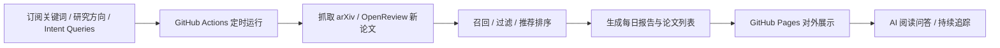

<p align="center">
  
</p>

<h1 align="center">Daily Paper Reader</h1>

<p align="center">
  Discover, summarize, and read the latest AI papers every day
</p>

<p align="center">
  <a href="https://github.com/ziwenhahaha/daily-paper-reader/stargazers">
    
  </a>
  <a href="https://github.com/ziwenhahaha/daily-paper-reader/network/members">
    
  </a>
  <a href="https://github.com/ziwenhahaha/daily-paper-reader/blob/main/LICENSE">
    
  </a>
  <a href="https://ziwenhahaha.github.io/daily-paper-reader">
    
  </a>
  <a href="https://ziwenhahaha.github.io/daily-paper-reader/#/newbie/README">
    
  </a>
</p>


## 界面预览


## News

- **2026-03-07** 更新首页与 README 展示文案，补充界面预览图，让首次访问更容易理解整体使用流程。
- **2026-03-06** 修复 LLM refine 补分与组合 query 打分逻辑，并补上回归测试，提升智能推荐稳定性。
- **2026-03-06** 新增首页使用教程入口与教程页，同时修复移动端导航和教程路由。
- **2026-03-05** 后台面板新增 30 天标准快速抓取入口，并加入指定 arXiv 论文的逐阶段命中追踪日志，便于排查抓取与召回。
- **2026-03-05** 向量召回链路改为 exact 优先，并增加 ANN 低密度回退，降低漏召回风险。
- **2026-03-04** 新增内容重置工作流入口，后台支持更安全地重建初始内容与站点数据。
- **2026-03-04** Released **v1.2.0** — 优化整体使用体验。
- **2026-02-28** Released **v1.1.0** — 优化订阅面板逻辑，不再需要手动记关键词。
- **2026-02-19** Released **v1.0.0** — 基础功能实现完成。

## Why Daily Paper Reader?

- **Daily Paper Radar**：每日自动抓取 arXiv / OpenReview 新论文，持续追踪研究前沿。
- **Personalized Feed**：基于关键词、研究方向与兴趣生成个性化推荐流。
- **Read + Ask in One Place**：支持沉浸式阅读与 AI 论文问答，边读边问。
- **Zero-Server Deployment**：依托 GitHub Actions 自动更新、GitHub Pages 部署，无需额外服务器。
- **Fork-and-Run**：Fork 后完成少量配置，即可上线自己的论文主页。

## 你可以把它用在哪里？

- **个人论文雷达**：持续追踪自己研究方向的新论文
- **实验室主页**：沉淀团队关注的论文脉络与阅读结果
- **日常阅读工作台**：把发现、阅读、问答、总结集中到一个入口

## Workflow Architecture



## 5 分钟内你能得到什么

| 能力 | 说明 |
| --- | --- |
| 每日新论文发现 | 自动抓取 arXiv / OpenReview 最新论文 |
| 个性化推荐流 | 按研究方向、关键词、兴趣推送 |
| 沉浸式阅读 | 快速查看摘要、链接与关键信息 |
| AI 论文问答 | 支持边读边问，辅助理解论文 |
| 自动更新 | GitHub Actions 定时运行，无需手动维护 |
| 一键部署 | GitHub Pages 发布，无需单独服务器 |

## 适合谁使用

- 想持续追踪某个研究方向的学生、研究者和工程师
- 想搭建私人论文推荐站点、实验室论文主页或阅读面板的开发者
- 想把「发现论文 → 阅读论文 → 提问总结」放到同一工作流的人

## 5 分钟快速启动

> [!TIP]
> 先准备一个大模型 API Key 和一个 GitHub PAT，之后完成 Fork、开启 Actions、开启 Pages 即可。

### 1) 准备大模型 API Key

当前 README 默认以 **柏拉图 API 平台** 为示例，建议先按默认配置跑通。

- 打开 [柏拉图 API 平台](https://api.bltcy.ai/)
- 完成注册 / 登录
- 充值并创建密钥

### 2) 准备 GitHub PAT

打开 [GitHub 新建 PAT 页面](https://github.com/settings/tokens/new?type=beta&scopes=repo,workflow,gist)，勾选以下权限：

- `repo`
- `workflow`
- `gist`

### 3) Fork 本仓库

Fork 到自己的 GitHub 账号下，建议仓库名保持 `daily-paper-reader` 不变。

### 4) 开启 GitHub Actions

进入你 Fork 的仓库，点击顶部 `Actions`，启用 `daily-paper-reader` 工作流。

### 5) 开启 GitHub Pages

进入 `Settings → Pages`：

- Source 选择 `Deploy from a branch`
- Branch 选择 `main`
- Folder 选择 `/(root)`

保存后等待约 1 分钟，站点地址会显示在页面顶部。

### 6) 打开站点验收

访问：

```text
https://<你的用户名>.github.io/daily-paper-reader
```

后续日常使用和配置，基本都可以在网页端完成。

## FAQ

### 需要服务器吗？

不需要。项目基于 **GitHub Actions + GitHub Pages** 运行和部署。

### 可以做哪些个性化配置？

你可以调整订阅关键词、研究方向、查询意图与日常阅读偏好，构建自己的论文推荐流。

### 适合实验室或团队一起用吗？

可以。它很适合做实验室公共论文面板，或者作为团队内部的论文发现与阅读入口。


## Star History

[](https://star-history.com/#ziwenhahaha/daily-paper-reader&Date)
