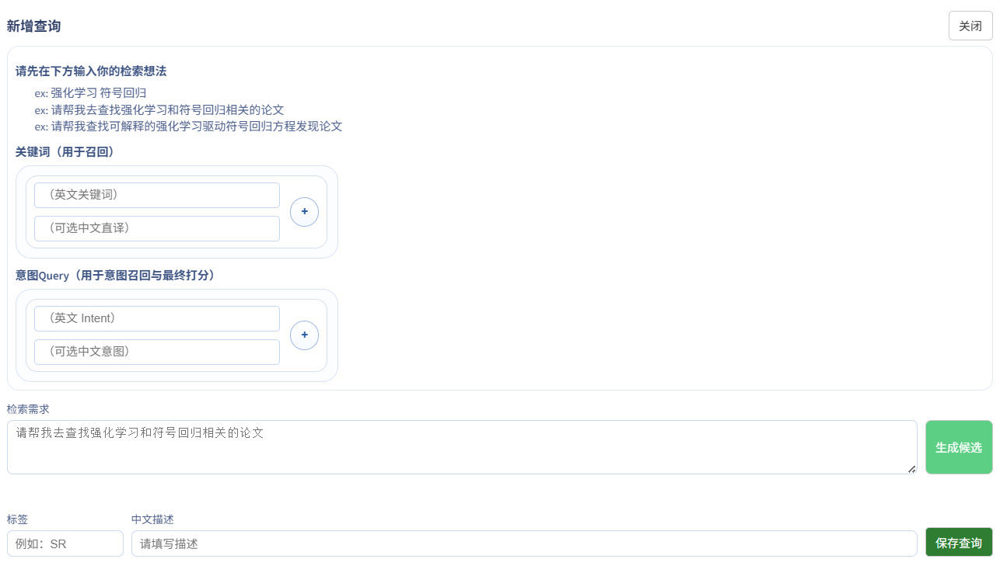
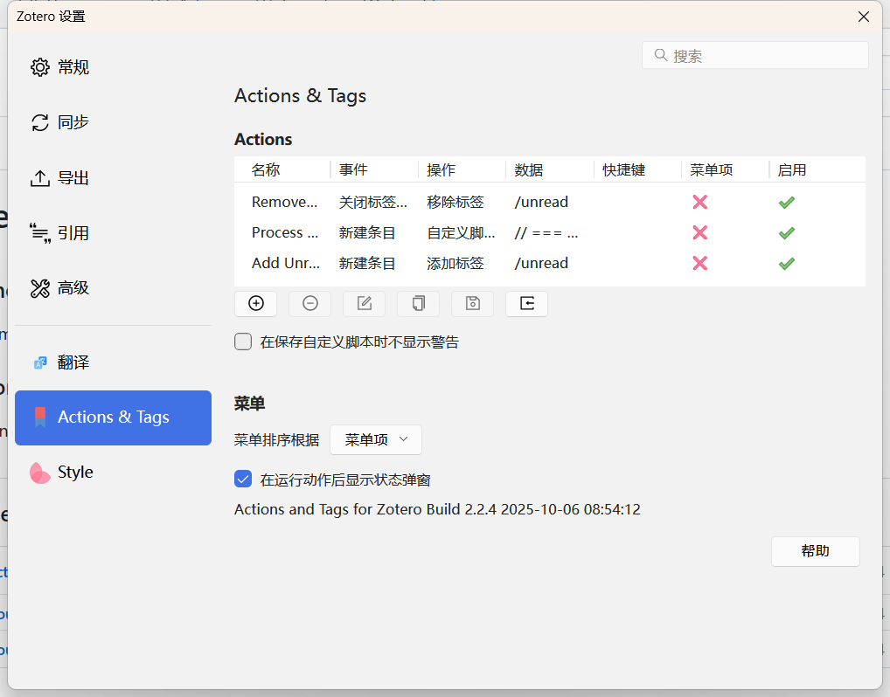
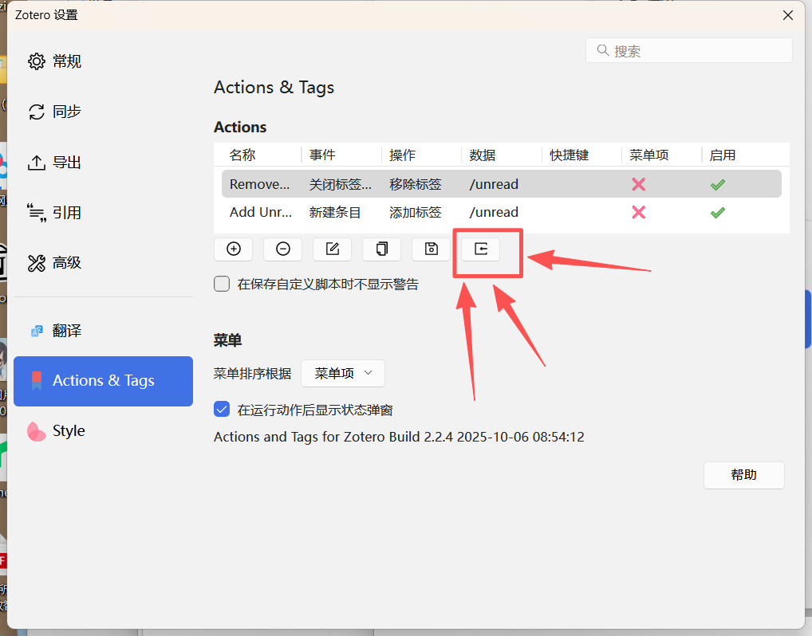
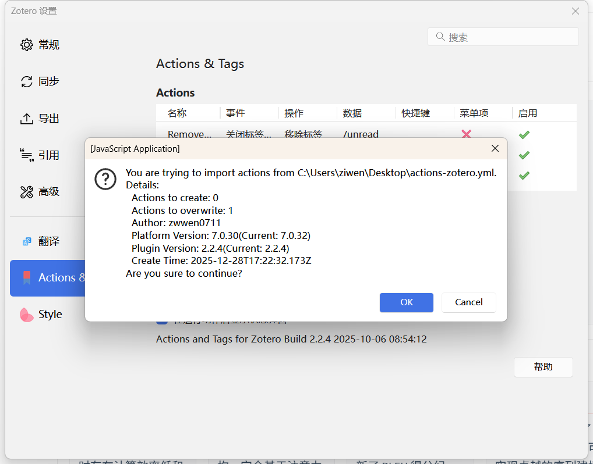

写在前面：

>一些小巧思：
>
>1、按键盘左右键，可以切换上一篇，下一篇论文
>
>2、按数字键1234，可以快速标记颜色
>
>3、在小屏状态下，左右滑动页面，可以切换上一篇下一篇
>
>4、配备了分享按钮，当觉得一篇论文很不错的时候，可以按分享按钮把论文分享出去
>
>5、觉得好的论文，可以在上zotero一键集成。

## 使用入口：

​	该项目的所有入口均在左下角小齿轮设置处，集成了所有的功能于一处。

  

在后台管理面板，点击新增，可以创建词条。

先在检索需求里面输入自己所需要检索的内容，然后点击生成候选之后，勾选需要的专题。

  

建议关键词保存**8个以内**，自然语言query保留**5个以内**。

保存查询之后，记得再次保存词条，接着可以点击右侧的搜寻论文板块，进行论文的第一次查询。

  

---

### 删除所有按钮

删除所有按钮，是把该仓库还原成什么都没爬取的状态，并不会重置密码。

### zotero集成

1、安装 zotero

2、安装 [Zotero | Connectors](https://www.zotero.org/download/connectors)

3、安装 `Actions & Tags` [Releases · windingwind/zotero-actions-tags](https://github.com/windingwind/zotero-actions-tags/releases/)

4、打开zotero设置，选中Actions & Tags进行配置

  

5、把该脚本下载下来，导入到zotero当中

  

  

在导入并启用该脚本之后，点开网页的zotero页面，就可以去一键保存了

  

